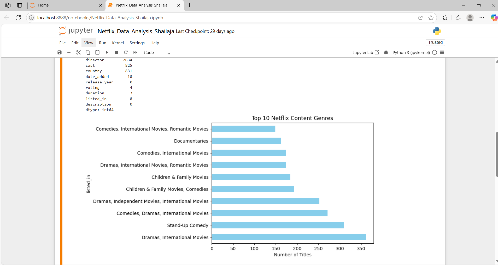
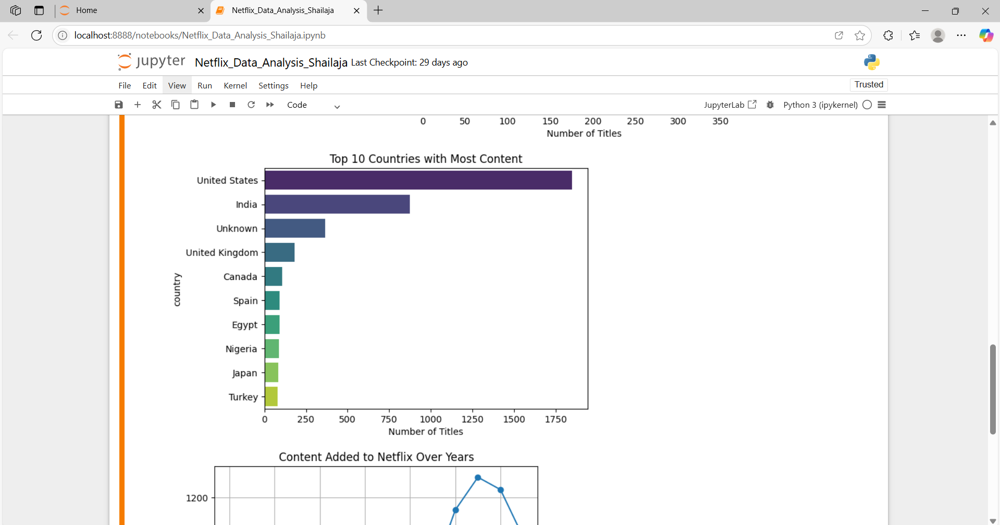
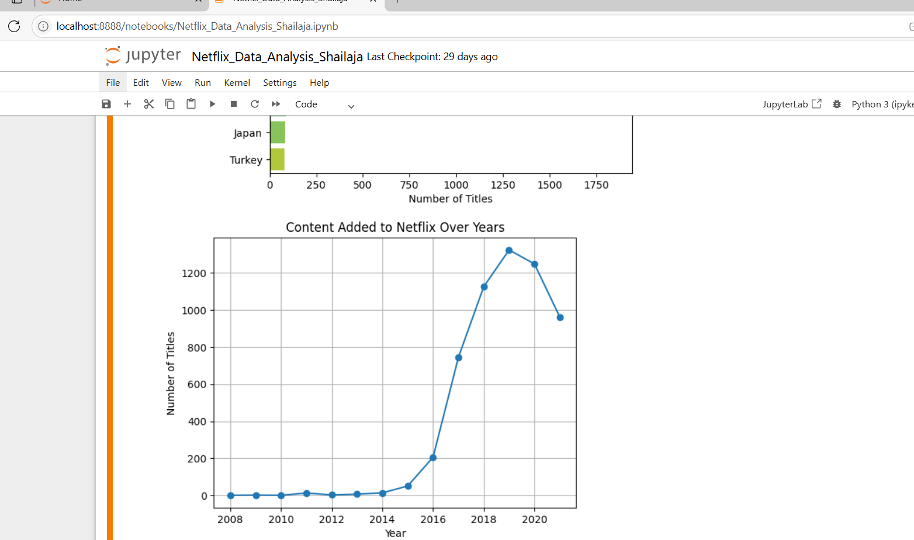

# 📊 Netflix EDA Project

A complete Exploratory Data Analysis (EDA) of the Netflix dataset using Python.

## 🧰 Tech Stack
- Python
- Pandas
- Matplotlib
- Seaborn

## 📌 Key Highlights
- Top genres and countries
- Content distribution over time
- Rating and duration trends

## 📁 Dataset
Netflix titles dataset from Kaggle.

## 📸 Sample Output
### Top Netflix Genres

### Top Countries with

### Content Added Over Years

## 🚀 How to Run
- Clone the repo
- Open the notebook file
- Run in Jupyter or Google Colab

## 📂 Dataset Source
This project uses the **Netflix Movies and TV Shows** dataset from Kaggle.  

## 🛠️ Tools & Libraries
- Python 🐍
- Pandas
- NumPy
- Matplotlib
- Seaborn
- Jupyter Notebook

## ▶️ How to Run
1. Download the dataset from the Kaggle link above.
2. Place `netflix_titles.csv` in the same folder as the notebook.
3. Open `NetflixEDA.ipynb` using Jupyter Notebook or Google Colab.
4. Run all cells to generate the analysis and charts.

## 💡 Skills Applied
- Data Cleaning & Preprocessing
- Handling Missing Values
- Data Visualization
- Exploratory Data Analysis (EDA)
- Working with Time Series

